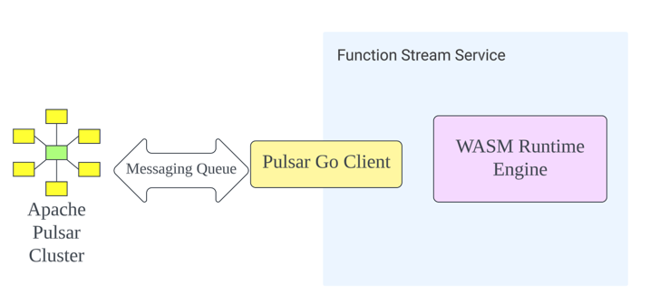

<!--
  Copyright 2024 Function Stream Org.

  Licensed under the Apache License, Version 2.0 (the "License");
  you may not use this file except in compliance with the License.
  You may obtain a copy of the License at

      http://www.apache.org/licenses/LICENSE-2.0

  Unless required by applicable law or agreed to in writing, software
  distributed under the License is distributed on an "AS IS" BASIS,
  WITHOUT WARRANTIES OR CONDITIONS OF ANY KIND, either express or implied.
  See the License for the specific language governing permissions and
  limitations under the License.
-->

# Function Stream

【Function stream is an event-streaming function platform based on Apache Pulsar and WebAssembly. It enables efficient and
scalable processing of data streams by leveraging the power of WebAssembly. Function Stream provides seamless
integration with Apache Pulsar, allowing users to take full advantage of its robust messaging capabilities.「根据下面列出的特性，详细补充这个介绍」】

## Features

1. 【**Support for Multiple Programming Languages**: Function Stream aims to provide the capability to write code using
   multiple programming languages. This allows developers to use their preferred language and harness its specific
   strengths while working with Function Stream.「不要使用Multiple这个词」】
2. **High Performance and Throughput**: Function Stream is designed to deliver high performance and handle substantial
   throughput. It strives to optimize resource utilization and minimize latency, enabling efficient execution of code
   and processing of data.
3. **Isolated Environment**: Function Stream offers an isolated environment for executing code. This ensures that each
   function runs independently, without interference from other functions or external factors. The isolation enhances
   the security, reliability, and predictability of code execution.
4. **Scalability and Fault Tolerance**: Function Stream focuses on scalability by offering the ability to effortlessly
   scale up or down based on workload demands. Additionally, it emphasizes fault tolerance, ensuring that system
   failures or errors do not disrupt the overall functioning of the platform.
4. **Support for Complex Data Schema**: Function Stream acknowledges the need to handle diverse data types and formats.
   It provides support for complex data schema, including bytes data and JSON format data, among others. This
   versatility enables developers to process and manipulate data efficiently within the platform.
6. **Stateful/Stateless Computing**: Function Stream caters to both stateful and stateless computing requirements. It
   accommodates scenarios where functions require maintaining state between invocations as well as situations where a
   stateless approach is more suitable. This flexibility allows developers to implement the desired architectural
   patterns.
7. **Cross-Architecture Platform Execution**: Function Stream aims to be a cross-architecture platform capable of
   executing code across different hardware architectures seamlessly. It provides compatibility and portability,
   allowing developers to run their code on various platforms without concerns about underlying hardware dependencies.

## Architecture and Components

Function Stream is composed of three main components: the WebAssembly runtime engine, the Pulsar client, and the
Function Stream service. The following figure shows the overview of the Function Stream architecture.


The **WebAssembly runtime engine** is responsible for executing the WebAssembly modules that implement the stream
processing logic. The runtime engine supports an interface for the underlying wasm runtime library. We use [wazero
](https://github.com/tetratelabs/wazero) as the
WebAssembly runtime library, as they are both fast and lightweight. The WebAssembly runtime
engine communicates with the Pulsar client through standard IO and file systems.

**The Pulsar client** is responsible for consuming and publishing the messages from and to the Apache Pulsar cluster. We
use [Pulsar Go client](https://github.com/apache/pulsar-client-go), which is a pure go implementation of the pulsar
client library, to interact with the Pulsar brokers. The Pulsar client handles the data schema, the message metadata,
and the processing guarantees of the messages.

**The Function Stream service** is responsible for managing the lifecycle and coordination of the WebAssembly instances.

## Directory Structure

The Function Stream project is organized as follows:
```plaintext
├── LICENSE                 # The license for Function Stream
├── Makefile                # Contains build automation and commands
├── README.md               # README file for the project
├── benchmark               # Contains benchmarking tools or results
├── bin                     # Contains compiled binary files
├── cmd                     # Contains the command line executable source files
├── common                  # Contains common utilities and libraries used across the project
├── docs                    # Documentation for the project
├── examples                # Example configurations, scripts, and other reference materials
├── go.mod                  # Defines the module's module path and its dependency requirements
├── go.sum                  # Contains the expected cryptographic checksums of the content of specific module versions
├── fs                      # Core library files for Function Stream
├── license-checker         # Tools related to checking license compliance
├── openapi.yaml            # API definition file
├── perf                    # Performance testing scripts
├── restclient              # REST client library
├── server                  # Server-side application source files
└── tests                   # Contains test scripts and test data
```

## Building Instructions

To compile Function Stream, use this command:

```shell
make build_all
```

This creates the function-stream binary program and example wasm files in the `bin` directory,
like `bin/example_basic.wasm`.

## Running Instructions

You have two ways to start the function stream server.

### Option 1: Standalone Mode (for development and testing)

Use this command to start the standalone server:

```shell
bin/function-stream standalone
```

### Option 2: Server Mode (for production)

First, start an Apache Pulsar service. See this [doc](https://pulsar.apache.org/docs/en/standalone/) for instructions.

Then, use this command to start the server based on Apache Pulsar:

```shell
bin/function-stream server
```

### Creating a Function

We'll use `example_basic.wasm` as an example wasm file. This function increases the money by 1. See the
code [here](examples/basic/main.go).

After starting the server, create a function with this command:

```shell
bin/function-stream client create -n example -a "bin/example_basic.wasm" -i example-input -o example-output -r 1
```

This creates a function named `example` using `example_basic.wasm`. It takes messages from `example-input`, produces
messages to `example-output`, and runs with 1 replica.

### Consuming a Message from the Function Output

After creating the function, consume a message from the output topic with this command:

```shell
bin/function-stream client consume -n example-output
```

### Producing a Message to the Function Input

In a new terminal, produce a message to the input topic with this command:

```shell
bin/function-stream client produce -n example-input -c '{"name":"rbt","money":2}'
```

You'll see this log:

```
Event produced
```

### Checking the Output

In the terminal where you consume the message from the output topic, you'll see this log:

```
"{\"name\":\"rbt\",\"money\":3,\"expected\":0}"
```

### Deleting the Function

After testing, delete the function with this command:

```shell
bin/function-stream client delete -n example
```

## Contributing

We're happy to receive contributions from the community. If you find a bug or have a feature request, please open an
issue or submit a pull request.

## License

This project is licensed under the [Apache License 2.0](https://www.apache.org/licenses/LICENSE-2.0).