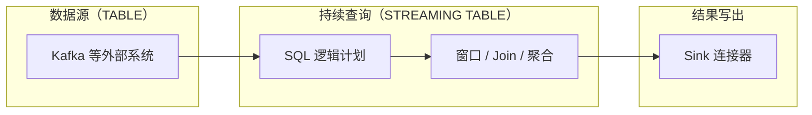

<!--

    Licensed to the Apache Software Foundation (ASF) under one
    or more contributor license agreements.  See the NOTICE file
    distributed with this work for additional information
    regarding copyright ownership.  The ASF licenses this file
    to you under the Apache License, Version 2.0 (the
    "License"); you may not use this file except in compliance
    with the License.  You may obtain a copy of the License at

        http://www.apache.org/licenses/LICENSE-2.0

    Unless required by applicable law or agreed to in writing,
    software distributed under the License is distributed on an
    "AS IS" BASIS, WITHOUT WARRANTIES OR CONDITIONS OF ANY
    KIND, either express or implied.  See the License for the
    specific language governing permissions and limitations
    under the License.

-->

# Function Stream：Streaming SQL 使用指南

[中文](streaming-sql-guide-zh.md) | [English](streaming-sql-guide.md)

Function Stream 提供了声明式 SQL 接口来构建实时流处理管道。通过 Streaming SQL，您可以轻松应对无界数据流（Unbounded Data）的摄取、时间窗口聚合、流式关联以及任务生命周期管理 —— **全程无需编写任何命令式代码**。

### 数据流与管道鸟瞰



> **阅读提示**：下图各节与「目录导览」中的锚点一一对应；遇到规划报错时，以 SQL 引擎返回信息为准。

---

## 目录导览

| 章节 | 说明 |
|------|------|
| [1. SQL 语法兼容性](#1-sql-语法兼容性) | DataFusion + Function Stream 扩展 |
| [2. 核心概念](#2-核心概念) | TABLE / STREAMING TABLE / 事件时间 / 水位线 |
| [3. 查询语法结构](#3-查询语法结构) | `WITH` → `SELECT` → `FROM` → `JOIN` → … |
| [4. JOIN 语法与支持](#4-join-语法与支持) | 写法、语义矩阵、`ON` 深度说明 |
| [实战一：注册数据源 (TABLE)](#实战一注册数据源-table) | `CREATE TABLE` + `WATERMARK` + `WITH` |
| [实战二：构建实时 Pipeline](#实战二构建实时-pipeline-streaming-table) | 四个完整场景 SQL |
| [实战三：生命周期与流任务管理](#实战三生命周期与流任务管理) | `SHOW` / `DROP STREAMING TABLE` |
| [SQL 语法速查表](#sql-语法速查表) | 常用语句一页表 |

---

<a id="1-sql-语法兼容性"></a>

## 1. SQL 语法兼容性

> **核心概括**：Function Stream 的语法体系可以理解为 **「DataFusion SQL + Function Stream 流式 DDL 扩展」**。

| 层次 | 技术要点 |
|------|----------|
| **解析与规划** | SQL 经 **sqlparser** 解析，使用 Function Stream 定制的 **`FunctionStreamDialect`**，再由 **Apache DataFusion** 的 SQL 前端（`SqlToRel`）与逻辑规划器生成执行计划。 |
| **查询（`SELECT …`）语法** | 遵循 **DataFusion SQL**，整体接近 **ANSI SQL**，风格上多偏 **PostgreSQL**（标识符、常用函数、`JOIN` / `WHERE` / `GROUP BY` 等）。 |
| **兼容边界** | **不是**完整的 PostgreSQL 兼容。DataFusion 不接受的写法，或被流式改写器明确禁止的用法（例如对**无界流**进行全局 `ORDER BY` / `LIMIT`），会在**规划阶段**直接报错拦截。 |
| **流式 / 目录 DDL** | 例如 `WATERMARK FOR`、`CREATE STREAMING TABLE … AS SELECT`、`SHOW STREAMING TABLES`、`DROP STREAMING TABLE`，以及 `CREATE TABLE` 上的连接器 `WITH ('key' = 'value', …)` 等，均属于 **Function Stream 独有扩展**。 |

---

<a id="2-核心概念"></a>

## 2. 核心概念

在开始编写 SQL 前，请先理解以下四个支撑流处理的核心概念：

| 概念 | SQL 关键字 | 说明 |
|------|------------|------|
| **逻辑表 (TABLE)** | `CREATE TABLE` | 数据的「目录项」：注册在系统 **Catalog** 中的**静态定义**，仅记录外部数据源的连接信息、格式和 Schema，**不消耗计算资源**。 |
| **流任务 (STREAMING TABLE)** | `CREATE STREAMING TABLE ... AS SELECT` | **持续运行的物理管道**：引擎在后台拉起分布式计算任务，将结果以**纯追加（Append-only）**方式持续写入外部系统。 |
| **事件时间 (Event Time)** | `WATERMARK FOR <column>` | 引擎内部用于**推进时间进度**、触发窗口结算的**时间基准列**。 |
| **水位线 (Watermark)** | `AS <column> - INTERVAL ...` | 对**迟到、乱序**数据的容忍度；时间推进由水位线驱动，**过度迟到**的事件会被安全丢弃。 |

> **完整参考**：支持的连接器、数据格式和 SQL 数据类型，请参阅 [连接器、格式与类型参考](connectors-and-formats-zh.md)。

---

<a id="3-查询语法结构"></a>

## 3. 查询语法结构

`CREATE STREAMING TABLE ... AS` 后面是一条**持续运行**的查询，其主体子句顺序与**标准 SQL**一致：

```text
[ WITH with_query [, ...] ]
SELECT select_expr [, ...]
FROM from_item
[ JOIN join_item [, ...] ]
[ WHERE condition ]
[ GROUP BY grouping_element [, ...] ]
[ HAVING condition ]
```

| 子句 | 作用 |
|------|------|
| **`WITH`** | 可选公用表表达式（CTE），便于拆分复杂查询。 |
| **`SELECT` / `FROM`** | 投影与输入关系（目录表、子查询等）。 |
| **`JOIN`** | 多路输入关联（例如窗口双流 JOIN）。 |
| **`WHERE`** | 在聚合或关联**之前**生效的行级过滤。 |
| **`GROUP BY` / `HAVING`** | 分组键与聚合后的过滤；流计算中常与 `TUMBLE(...)`、`HOP(...)`、`SESSION(...)` 产生的窗口列配合使用。 |

---

<a id="4-join-语法与支持"></a>

## 4. JOIN 语法与支持

流式 JOIN 是实时计算中语义最重的算子之一；Function Stream 通过规划器规则约束**有界状态**与**shuffle 键**。

### 4.1 SQL 写法

关联紧跟在 `FROM` 之后（或接在前一个 `join_item` 之后），支持连续多表关联：

```text
from_item
  { [ INNER ] JOIN
  | LEFT  [ OUTER ] JOIN
  | RIGHT [ OUTER ] JOIN
  | FULL  [ OUTER ] JOIN
  } from_item
  ON join_condition
```

`INNER JOIN` 与单独写 `JOIN` 等价；`OUTER` 可省略（`LEFT JOIN` 即 `LEFT OUTER JOIN`）。

```text
FROM a
JOIN b ON ...
LEFT JOIN c ON ...
```

### 4.2 当前规划器支持的语义矩阵

| 业务场景 | 允许的 Join 类型 | 约束与说明 |
|----------|------------------|------------|
| **双流均无窗口**（持续更新型关联） | **仅 `INNER`** | 外连接 `LEFT` / `RIGHT` / `FULL` 会被拒绝：需要**有界状态**（如窗口）。`ON` 须含**至少一组等值条件**。 |
| **两侧具有相同窗口**（时间对齐关联） | **`INNER`、`LEFT`、`RIGHT`、`FULL`** | 两侧窗口定义须**完全一致**。**不支持**以 **`SESSION` 窗口**作为 Join 输入。`ON` 须包含两侧的**同一窗口列**（及业务等值键）。 |
| **混合窗口类型** | — | **不支持**（一侧有窗口、一侧无窗口会被拒绝）。 |

### 4.3 连接条件（`ON`）说明

- 流关联改写器目前仅支持 **`ON join_condition`**；**`USING (...)`** 与**自然连接**在流式计划中**未实现**。

针对**无窗口**的双流 **`INNER JOIN`**，还须同时满足：

1. **必须存在等值键**：规划器收集「左 = 右」用于 **Shuffle / 分区**；若等值键列表为空，规划报错。
2. **标准等值连接（equi-join）**：由若干组 **`左侧 = 右侧`** 用 **`AND`** 连接。

合法示例：

```sql
-- 单键等值
ON o.order_id = s.order_id
```

```sql
-- 多键等值
ON o.tenant_id = s.tenant_id AND o.order_id = s.order_id
```

不合法（不满足无窗口双流 INNER 规划要求）：`ON` 中**仅有**范围比较、缺乏成对 **`左 = 右`** 的等值结构等。

对齐窗口下的 `LEFT JOIN` 完整示例见 [场景 4：窗口双流关联](#场景-4窗口双流关联-window-join)。

---

<a id="实战一注册数据源-table"></a>

## 实战一：注册数据源 (TABLE)

从两条典型业务流开始：**广告曝光流**与**广告点击流**。

> **核心原则**：必须为输入流声明 **事件时间** 与 **水位线**，这是引擎推进时间的**唯一依据**。

```sql
-- 1. 注册广告曝光流
CREATE TABLE ad_impressions (
    impression_id VARCHAR,
    ad_id BIGINT,
    campaign_id BIGINT,
    user_id VARCHAR,
    impression_time TIMESTAMP NOT NULL,
    -- 核心：将 impression_time 设为事件时间，并容忍最多 2 秒的数据迟到乱序
    WATERMARK FOR impression_time AS impression_time - INTERVAL '2' SECOND
) WITH (
    'connector' = 'kafka',
    'topic' = 'raw_ad_impressions',
    'format' = 'json',
    'bootstrap.servers' = 'localhost:9092'
);

-- 2. 注册广告点击流
CREATE TABLE ad_clicks (
    click_id VARCHAR,
    impression_id VARCHAR,
    ad_id BIGINT,
    click_time TIMESTAMP NOT NULL,
    WATERMARK FOR click_time AS click_time - INTERVAL '5' SECOND
) WITH (
    'connector' = 'kafka',
    'topic' = 'raw_ad_clicks',
    'format' = 'json',
    'bootstrap.servers' = 'localhost:9092'
);
```

| 要素 | 含义 |
|------|------|
| `WATERMARK FOR <列> AS <列> - INTERVAL 'n' SECOND` | 声明事件时间列与最大可容忍乱序延迟。 |
| `WITH (...)` | 连接器属性：类型、Topic、格式、Broker 等。 |

---

<a id="实战二构建实时-pipeline-streaming-table"></a>

## 实战二：构建实时 Pipeline (STREAMING TABLE)

下面用 **4 个工业界常见场景**，演示 `CREATE STREAMING TABLE ... AS SELECT` 如何落地为实时拓扑。

<a id="场景-1滚动窗口-tumbling-window"></a>

### 场景 1：滚动窗口 (Tumbling Window)

**业务需求**：每 1 分钟统计一次各**广告计划**的曝光总量。  
**特性**：时间轴被切成**固定大小、互不重叠**的桶，例如 `[00:00–00:01)`、`[00:01–00:02)` …

```sql
CREATE STREAMING TABLE metric_tumble_impressions_1m WITH (
    'connector' = 'kafka',
    'topic' = 'sink_impressions_1m',
    'format' = 'json',
    'bootstrap.servers' = 'localhost:9092'
) AS
SELECT
    TUMBLE(INTERVAL '1' MINUTE) AS time_window,
    campaign_id,
    COUNT(*) AS total_impressions
FROM ad_impressions
GROUP BY
    1, -- 指代 SELECT 中的第一个字段 (time_window)
    campaign_id;
```

<a id="场景-2滑动窗口-hopping-window"></a>

### 场景 2：滑动窗口 (Hopping Window)

**业务需求**：统计**过去 10 分钟**内各广告的独立访客数（UV），且**每 1 分钟**输出一次刷新结果。  
**特性**：窗口**相互重叠**，适合平滑的实时趋势监控。

```sql
CREATE STREAMING TABLE metric_hop_uv_10m WITH (
    'connector' = 'kafka',
    'topic' = 'sink_uv_10m_step_1m',
    'format' = 'json',
    'bootstrap.servers' = 'localhost:9092'
) AS
SELECT
    HOP(INTERVAL '1' MINUTE, INTERVAL '10' MINUTE) AS time_window,
    ad_id,
    COUNT(DISTINCT CAST(user_id AS STRING)) AS unique_users
FROM ad_impressions
GROUP BY
    1,
    ad_id;
```

<a id="场景-3会话窗口-session-window"></a>

### 场景 3：会话窗口 (Session Window)

**业务需求**：按用户观察广告曝光**会话**；若该用户 **30 秒**内无新曝光，则视为会话结束并输出统计。  
**特性**：窗口边界由**数据到达疏密**动态决定，适合**行为链路 / 会话分析**。

```sql
CREATE STREAMING TABLE metric_session_impressions WITH (
    'connector' = 'kafka',
    'topic' = 'sink_session_impressions',
    'format' = 'json',
    'bootstrap.servers' = 'localhost:9092'
) AS
SELECT
    SESSION(INTERVAL '30' SECOND) AS time_window,
    user_id,
    COUNT(*) AS impressions_in_session
FROM ad_impressions
GROUP BY
    1,
    user_id;
```

<a id="场景-4窗口双流关联-window-join"></a>

### 场景 4：窗口双流关联 (Window Join)

**业务需求**：联合曝光流与点击流，计算 **5 分钟粒度**点击率相关指标。  
**特性**：两条流在**完全相同**的时间窗口内对齐；水位线越过窗口后状态可回收，**避免无界状态导致 OOM**。

```sql
CREATE STREAMING TABLE metric_window_join_ctr_5m WITH (
    'connector' = 'kafka',
    'topic' = 'sink_ctr_5m',
    'format' = 'json',
    'bootstrap.servers' = 'localhost:9092'
) AS
SELECT
    imp.time_window,
    imp.ad_id,
    imp.impressions,
    COALESCE(clk.clicks, 0) AS clicks
FROM (
    -- 左流：5 分钟曝光量
    SELECT TUMBLE(INTERVAL '5' MINUTE) AS time_window, ad_id, COUNT(*) AS impressions
    FROM ad_impressions
    GROUP BY 1, ad_id
) imp
LEFT JOIN (
    -- 右流：5 分钟点击量
    SELECT TUMBLE(INTERVAL '5' MINUTE) AS time_window, ad_id, COUNT(*) AS clicks
    FROM ad_clicks
    GROUP BY 1, ad_id
) clk
-- 关键：ON 须包含时间窗口列，保证状态有界
ON imp.time_window = clk.time_window AND imp.ad_id = clk.ad_id;
```

> **硬性要求**：关联条件**必须**包含**相同的时间窗口列**，以确保 Join 状态有界。

---

<a id="实战三生命周期与流任务管理"></a>

## 实战三：生命周期与流任务管理

Function Stream 提供与**目录元数据**、**运行中管道**、**物理拓扑**相关的运维类 SQL。

<a id="1-数据源与元数据管理"></a>

### 1. 数据源与元数据管理

```sql
-- 已注册的静态表（数据源）；结果形态由引擎决定
SHOW TABLES;

-- 表定义 / 选项文本；结果形态由引擎决定
SHOW CREATE TABLE ad_clicks;
```

<a id="2-实时-pipeline-监控与排障"></a>

### 2. 实时 Pipeline 监控与排障

```sql
-- 正在运行的流任务（结果集形态由引擎决定）
SHOW STREAMING TABLES;

-- 某条管道的物理计划 / 拓扑文本（展示格式由引擎决定）
SHOW CREATE STREAMING TABLE metric_tumble_impressions_1m;
```

> **说明**：各类 `SHOW …` 的列名、类型与终端排版可能随版本变化，请以实际 CLI 或服务端返回为准。

<a id="3-安全停止与释放资源"></a>

### 3. 安全停止与释放资源

```sql
DROP STREAMING TABLE metric_tumble_impressions_1m;
```

> **说明**：`DROP STREAMING TABLE` 停止**流计算任务**并释放运行资源；**不会**删除 `CREATE TABLE` 注册的**数据源目录项**，源表可继续被新管道引用。

---

<a id="sql-语法速查表"></a>

## SQL 语法速查表

| 目标操作 | 典型 SQL / 语法要点 |
|----------|---------------------|
| 注册数据源 | `CREATE TABLE name (...) WITH (...)`，并配合 `WATERMARK FOR` |
| 定义事件时间 / 水位线 | `WATERMARK FOR <col> AS <col> - INTERVAL 'n' SECOND` |
| 创建流任务 | `CREATE STREAMING TABLE name WITH (...) AS SELECT ...` |
| 查询子句骨架 | `WITH` → `SELECT` → `FROM` → `[JOIN]` → `[WHERE]` → `[GROUP BY]` → `[HAVING]`（详见 [第 3 节](#3-查询语法结构)） |
| 多流 JOIN | `INNER` / `LEFT` / `RIGHT` / `FULL` + `ON`（约束见 [第 4 节](#4-join-语法与支持)） |
| 时间窗口函数 | `TUMBLE(interval)`、`HOP(slide, size)`、`SESSION(gap)` |
| 查看源表 | `SHOW TABLES`；`SHOW CREATE TABLE <name>` |
| 监控计算流 | `SHOW STREAMING TABLES` |
| 排查执行图 | `SHOW CREATE STREAMING TABLE <name>` |
| 停止流任务 | `DROP STREAMING TABLE <name>` |
