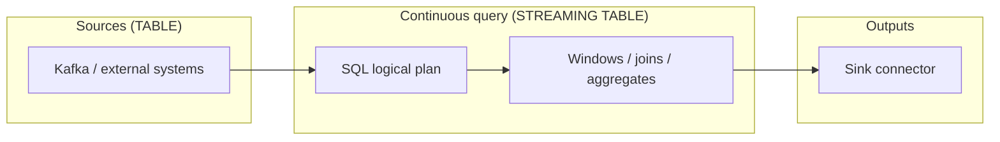

<!--

    Licensed to the Apache Software Foundation (ASF) under one
    or more contributor license agreements.  See the NOTICE file
    distributed with this work for additional information
    regarding copyright ownership.  The ASF licenses this file
    to you under the Apache License, Version 2.0 (the
    "License"); you may not use this file except in compliance
    with the License.  You may obtain a copy of the License at

        http://www.apache.org/licenses/LICENSE-2.0

    Unless required by applicable law or agreed to in writing,
    software distributed under the License is distributed on an
    "AS IS" BASIS, WITHOUT WARRANTIES OR CONDITIONS OF ANY
    KIND, either express or implied.  See the License for the
    specific language governing permissions and limitations
    under the License.

-->

# Function Stream: Streaming SQL Guide

[中文](streaming-sql-guide-zh.md) | [English](streaming-sql-guide.md)

Function Stream provides a declarative SQL interface for building real-time stream processing pipelines. With Streaming SQL you can ingest unbounded data streams, perform time-windowed aggregations, join multiple streams, and manage pipeline lifecycles — **without writing imperative code end to end**.

### End-to-end data flow



> **How to use this guide**: section anchors match the **Guide map** table below. When planning fails, treat the SQL engine error message as authoritative.

---

## Guide map

| Section | What it covers |
|---------|----------------|
| [1. SQL dialect compatibility](#1-sql-dialect-compatibility) | DataFusion + Function Stream extensions |
| [2. Core concepts](#2-core-concepts) | TABLE / STREAMING TABLE / event time / watermark |
| [3. Query syntax outline](#3-query-syntax-outline) | `WITH` → `SELECT` → `FROM` → `JOIN` → … |
| [4. Join syntax and support](#4-join-syntax-and-support) | Syntax, semantics matrix, `ON` clause details |
| [Hands-on 1: Register sources (TABLE)](#hands-on-1-register-sources-table) | `CREATE TABLE` + `WATERMARK` + `WITH` |
| [Hands-on 2: Build pipelines](#hands-on-2-build-pipelines-streaming-table) | Four full scenario SQL examples |
| [Hands-on 3: Lifecycle & jobs](#hands-on-3-lifecycle-and-streaming-jobs) | `SHOW` / `DROP STREAMING TABLE` |
| [SQL quick reference](#sql-quick-reference) | One-page statement cheat sheet |

---

<a id="1-sql-dialect-compatibility"></a>

## 1. SQL dialect compatibility

> **Bottom line**: Function Stream is **“DataFusion SQL + Function Stream streaming DDL extensions.”**

| Layer | Details |
|-------|---------|
| **Parser & planner** | SQL is parsed with **sqlparser** using the **`FunctionStreamDialect`**, then planned through **Apache DataFusion**’s SQL frontend (`SqlToRel`) and logical planner. |
| **Query (`SELECT …`) syntax** | **DataFusion SQL**: broadly **ANSI-like**, often **PostgreSQL-flavored** (identifiers, common functions, `JOIN` / `WHERE` / `GROUP BY`, etc.). |
| **Compatibility limits** | **Not** full PostgreSQL. Constructs DataFusion rejects, or that streaming rewriters forbid (e.g. global `ORDER BY` / `LIMIT` on **unbounded** queries), fail at **plan time**. |
| **Streaming / catalog DDL** | `WATERMARK FOR`, `CREATE STREAMING TABLE … AS SELECT`, `SHOW STREAMING TABLES`, `DROP STREAMING TABLE`, and connector `WITH ('key' = 'value', …)` on `CREATE TABLE` are **Function Stream–specific** extensions. |

---

<a id="2-core-concepts"></a>

## 2. Core concepts

Understand these four ideas before you write streaming SQL:

| Concept | SQL keyword | Description |
|---------|-------------|-------------|
| **Logical table (TABLE)** | `CREATE TABLE` | A **catalog entry**: static definition of an external source (connection, format, schema). **No compute** is consumed until a pipeline reads it. |
| **Streaming job (STREAMING TABLE)** | `CREATE STREAMING TABLE ... AS SELECT` | A **continuous physical pipeline**: the engine runs distributed tasks and appends results to external systems in **append-only** mode. |
| **Event time** | `WATERMARK FOR <column>` | The **time basis** the engine uses to advance time and trigger window completion. |
| **Watermark** | `AS <column> - INTERVAL ...` | **Tolerated lateness / disorder**; time advances with watermarks, and **very late** events are dropped safely. |

> **Full reference** for connectors, formats, and SQL types: [Connectors, Formats & Data Types](connectors-and-formats.md).

---

<a id="3-query-syntax-outline"></a>

## 3. Query syntax outline

`CREATE STREAMING TABLE ... AS` wraps a **continuous** query whose clause order matches **standard SQL**:

```text
[ WITH with_query [, ...] ]
SELECT select_expr [, ...]
FROM from_item
[ JOIN join_item [, ...] ]
[ WHERE condition ]
[ GROUP BY grouping_element [, ...] ]
[ HAVING condition ]
```

| Clause | Role |
|--------|------|
| **`WITH`** | Optional CTEs for readability. |
| **`SELECT` / `FROM`** | Projections and inputs (catalog tables, subqueries, etc.). |
| **`JOIN`** | Combine inputs (e.g. aligned window joins). |
| **`WHERE`** | Row filters **before** aggregation / join evaluation. |
| **`GROUP BY` / `HAVING`** | Grouping keys and post-aggregate filters; often used with `TUMBLE(...)`, `HOP(...)`, `SESSION(...)`. |

Whether a clause is accepted depends on the engine and planner; use the frontend error if planning fails.

---

<a id="4-join-syntax-and-support"></a>

## 4. Join syntax and support

Streaming joins are among the heaviest operators; Function Stream enforces **bounded state** and **shuffle keys** through planner rules.

### 4.1 SQL shape

Joins follow `FROM` (or a prior `join_item`) and can be chained:

```text
from_item
  { [ INNER ] JOIN
  | LEFT  [ OUTER ] JOIN
  | RIGHT [ OUTER ] JOIN
  | FULL  [ OUTER ] JOIN
  } from_item
  ON join_condition
```

`INNER JOIN` and `JOIN` are equivalent; `OUTER` is optional (`LEFT JOIN` = `LEFT OUTER JOIN`).

```text
FROM a
JOIN b ON ...
LEFT JOIN c ON ...
```

### 4.2 Semantics matrix (current planner)

| Scenario | Allowed join kinds | Constraints |
|----------|-------------------|-------------|
| **Stream–stream, no window on both sides** (“updating” join) | **`INNER` only** | `LEFT` / `RIGHT` / `FULL` rejected: **bounded** state (e.g. windows) required. `ON` needs **at least one equality** predicate. |
| **Stream–stream, identical tumbling/hopping window on both sides** | **`INNER`**, **`LEFT`**, **`RIGHT`**, **`FULL`** | Window specs must **match exactly**. **`SESSION` windows are not supported** as join inputs. `ON` must include the **same window column** on both sides (plus business equi-keys). |
| **Mixed windowing** | — | **Not supported** (one side windowed, one not). |

### 4.3 `ON` clause details

- Only **`ON join_condition`** is implemented in the streaming join rewriter; **`USING (...)`** and **natural joins** are **not** supported on streaming plans.

For **non-windowed** stream–stream **`INNER JOIN`**, you also need:

1. **At least one equi-key** — the planner collects `left = right` pairs for **shuffle / partitioning**; an empty equi-key list fails planning.
2. **Equi-join shape** — a conjunction of **`left = right`** predicates joined with **`AND`**.

Valid examples:

```sql
-- single-key equality
ON o.order_id = s.order_id
```

```sql
-- composite-key equality
ON o.tenant_id = s.tenant_id AND o.order_id = s.order_id
```

Invalid for this path: `ON` with **only** range predicates, or no paired **`left = right`** structure.

A full aligned-window **`LEFT JOIN`** example is in [Scenario 4: Window join](#scenario-4-window-join).

---

<a id="hands-on-1-register-sources-table"></a>

## Hands-on 1: Registering data sources (TABLE)

Start from two common streams: **ad impressions** and **ad clicks**.

> **Rule**: every input stream must declare **event time** and a **watermark** — the **only** basis the engine uses to advance time.

```sql
-- 1. Register the ad-impressions stream
CREATE TABLE ad_impressions (
    impression_id VARCHAR,
    ad_id BIGINT,
    campaign_id BIGINT,
    user_id VARCHAR,
    impression_time TIMESTAMP NOT NULL,
    -- Event time + up to 2s out-of-order tolerance
    WATERMARK FOR impression_time AS impression_time - INTERVAL '2' SECOND
) WITH (
    'connector' = 'kafka',
    'topic' = 'raw_ad_impressions',
    'format' = 'json',
    'bootstrap.servers' = 'localhost:9092'
);

-- 2. Register the ad-clicks stream
CREATE TABLE ad_clicks (
    click_id VARCHAR,
    impression_id VARCHAR,
    ad_id BIGINT,
    click_time TIMESTAMP NOT NULL,
    WATERMARK FOR click_time AS click_time - INTERVAL '5' SECOND
) WITH (
    'connector' = 'kafka',
    'topic' = 'raw_ad_clicks',
    'format' = 'json',
    'bootstrap.servers' = 'localhost:9092'
);
```

| Element | Meaning |
|---------|---------|
| `WATERMARK FOR <col> AS <col> - INTERVAL 'n' SECOND` | Declares event-time column and max tolerated disorder. |
| `WITH (...)` | Connector properties: type, topic, format, brokers, etc. |

---

<a id="hands-on-2-build-pipelines-streaming-table"></a>

## Hands-on 2: Building real-time pipelines (STREAMING TABLE)

Four common patterns show how `CREATE STREAMING TABLE ... AS SELECT` becomes a running topology.

<a id="scenario-1-tumbling-window"></a>

### Scenario 1: Tumbling window

**Goal**: every **1 minute**, count **total impressions per campaign**.  
**Behavior**: fixed-size, **non-overlapping** buckets such as `[00:00–00:01)`, `[00:01–00:02)`, …

```sql
CREATE STREAMING TABLE metric_tumble_impressions_1m WITH (
    'connector' = 'kafka',
    'topic' = 'sink_impressions_1m',
    'format' = 'json',
    'bootstrap.servers' = 'localhost:9092'
) AS
SELECT
    TUMBLE(INTERVAL '1' MINUTE) AS time_window,
    campaign_id,
    COUNT(*) AS total_impressions
FROM ad_impressions
GROUP BY
    1, -- first SELECT column (time_window)
    campaign_id;
```

<a id="scenario-2-hopping-window"></a>

### Scenario 2: Hopping window

**Goal**: **UV per ad** over the **last 10 minutes**, **refreshed every 1 minute**.  
**Behavior**: **overlapping** windows — good for smoothed real-time trends.

```sql
CREATE STREAMING TABLE metric_hop_uv_10m WITH (
    'connector' = 'kafka',
    'topic' = 'sink_uv_10m_step_1m',
    'format' = 'json',
    'bootstrap.servers' = 'localhost:9092'
) AS
SELECT
    HOP(INTERVAL '1' MINUTE, INTERVAL '10' MINUTE) AS time_window,
    ad_id,
    COUNT(DISTINCT CAST(user_id AS STRING)) AS unique_users
FROM ad_impressions
GROUP BY
    1,
    ad_id;
```

<a id="scenario-3-session-window"></a>

### Scenario 3: Session window

**Goal**: per-user **impression sessions**; a session **ends** after **30 seconds** without new impressions.  
**Behavior**: window bounds follow **arrival density** — useful for **session / funnel** analytics.

```sql
CREATE STREAMING TABLE metric_session_impressions WITH (
    'connector' = 'kafka',
    'topic' = 'sink_session_impressions',
    'format' = 'json',
    'bootstrap.servers' = 'localhost:9092'
) AS
SELECT
    SESSION(INTERVAL '30' SECOND) AS time_window,
    user_id,
    COUNT(*) AS impressions_in_session
FROM ad_impressions
GROUP BY
    1,
    user_id;
```

<a id="scenario-4-window-join"></a>

### Scenario 4: Window join

**Goal**: combine impressions and clicks for **5-minute** CTR-style metrics.  
**Behavior**: both streams use the **same** window; when the watermark passes the window, state can be reclaimed — **avoiding unbounded state / OOM**.

```sql
CREATE STREAMING TABLE metric_window_join_ctr_5m WITH (
    'connector' = 'kafka',
    'topic' = 'sink_ctr_5m',
    'format' = 'json',
    'bootstrap.servers' = 'localhost:9092'
) AS
SELECT
    imp.time_window,
    imp.ad_id,
    imp.impressions,
    COALESCE(clk.clicks, 0) AS clicks
FROM (
    -- Left: 5-minute impressions
    SELECT TUMBLE(INTERVAL '5' MINUTE) AS time_window, ad_id, COUNT(*) AS impressions
    FROM ad_impressions
    GROUP BY 1, ad_id
) imp
LEFT JOIN (
    -- Right: 5-minute clicks
    SELECT TUMBLE(INTERVAL '5' MINUTE) AS time_window, ad_id, COUNT(*) AS clicks
    FROM ad_clicks
    GROUP BY 1, ad_id
) clk
-- ON must include the window column so join state stays bounded
ON imp.time_window = clk.time_window AND imp.ad_id = clk.ad_id;
```

> **Hard requirement**: the join predicate **must** include the **same window column** on both sides so join state stays bounded.

---

<a id="hands-on-3-lifecycle-and-streaming-jobs"></a>

## Hands-on 3: Lifecycle & streaming job management

Operational SQL for **catalog metadata**, **running pipelines**, and **physical topology**.

<a id="lifecycle-catalog-metadata"></a>

### 1. Catalog & metadata

```sql
-- Registered static tables (sources); result shape is engine-defined
SHOW TABLES;

-- Table definition / options text; result shape is engine-defined
SHOW CREATE TABLE ad_clicks;
```

<a id="lifecycle-monitoring"></a>

### 2. Monitoring & troubleshooting

```sql
-- Running streaming jobs (shape of result set is engine-defined)
SHOW STREAMING TABLES;

-- Physical plan / topology text for one pipeline (format is engine-defined)
SHOW CREATE STREAMING TABLE metric_tumble_impressions_1m;
```

> **Note:** Column names, types, and printable layout for `SHOW …` statements may change between releases; use the CLI or server response you get at runtime as the source of truth.

<a id="lifecycle-shutdown"></a>

### 3. Safe shutdown & resource release

```sql
DROP STREAMING TABLE metric_tumble_impressions_1m;
```

> **Note**: `DROP STREAMING TABLE` stops the **streaming job** and releases runtime resources; it does **not** remove **`CREATE TABLE`** source catalog entries — sources remain available for new pipelines.

---

<a id="sql-quick-reference"></a>

## SQL quick reference

| Goal | Typical SQL / syntax |
|------|----------------------|
| Register a source | `CREATE TABLE name (...) WITH (...)` plus `WATERMARK FOR` |
| Event time & watermark | `WATERMARK FOR <col> AS <col> - INTERVAL 'n' SECOND` |
| Create a streaming job | `CREATE STREAMING TABLE name WITH (...) AS SELECT ...` |
| Query skeleton | `WITH` → `SELECT` → `FROM` → `[JOIN]` → `[WHERE]` → `[GROUP BY]` → `[HAVING]` — see [Section 3](#3-query-syntax-outline) |
| Multi-stream joins | `INNER` / `LEFT` / `RIGHT` / `FULL` + `ON` — rules in [Section 4](#4-join-syntax-and-support) |
| Window TVFs | `TUMBLE(interval)`, `HOP(slide, size)`, `SESSION(gap)` |
| Inspect sources | `SHOW TABLES`; `SHOW CREATE TABLE <name>` |
| Inspect running jobs | `SHOW STREAMING TABLES` |
| Inspect physical plan | `SHOW CREATE STREAMING TABLE <name>` |
| Stop a streaming job | `DROP STREAMING TABLE <name>` |
